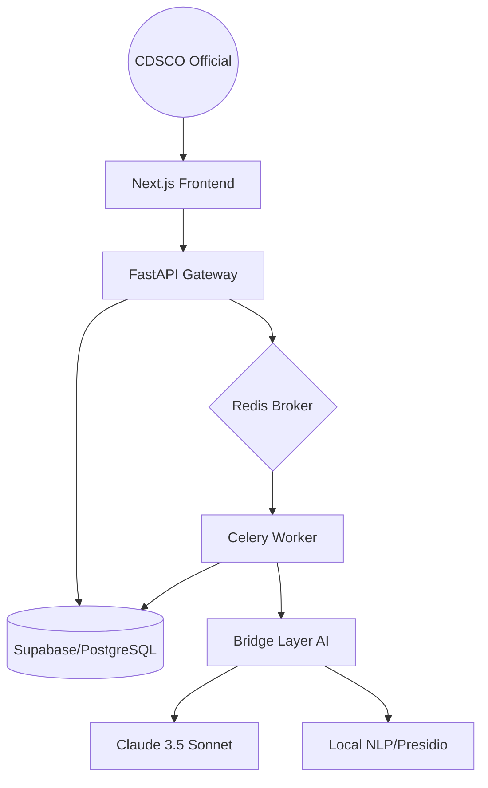

# NitiSetu Technical Architecture

This document details the high-level system design, data flow, and components of the NitiSetu Institutional Regulatory Intelligence platform.

## 🏗 System Overview

NitiSetu follows a distributed, modular architecture designed for high availability and secure regulatory processing.

---

## 🧩 Core Components

### 1. Frontend Gateway (Next.js 14)
- **Role**: Presentation and interaction layer.
- **Key Modules**:
    - `DocumentSelector`: Consolidated file selection across features.
    - `InspectionReportViewer`: Sanitized HTML rendering for AI reports.
    - `TanStack Query`: Server-state management and polling.
- **Security**: Supabase-ready JWT authentication with automatic header injection via custom `api.ts` client.

### 2. API Services (FastAPI)
- **Role**: Orchestration, validation, and metadata management.
- **Stateless Design**: All long-running AI tasks are offloaded to background workers.
- **Authentication**: JWT verification dependency applied at the router level.

### 3. Background Processing (Celery & Redis)
- **Role**: Handles labor-intensive regulatory intelligence tasks.
- **Tasks**:
    - `process_anonymization`: Multi-stage PII detection and de-identification.
    - `process_completeness`: Structural analysis of submission dossiers.
    - `process_sae`: Semantic similarity and priority scoring.
- **Reliability**: Refactored for modern `asyncio.run` execution to prevent loop conflicts in worker threads.

### 4. Bridge Layer AI Strategy
- **Abstracted Clients**: A unified wrapper (`BridgeAI`) interacts with Claude, ensuring prompt consistency and standardized JSON outputs.
- **Local Encoders**: `SentenceTransformers` are used locally to ensure vector-based comparisons (SAE de-duplication) never leave the private infrastructure.

---

## 🔄 Data Lifecycle

1. **Upload**: User uploads a regulatory document (PDF/Image).
2. **Ingestion**: `docling` extracts text and stores it in the `documents` table.
3. **Queue**: A specific feature (e.g., Anonymisation) is triggered. A `job_id` is returned.
4. **Execution**: The Celery worker pulls the document, processes it via the AI layer, and writes results to `processing_jobs`.
5. **Observability**: Every sensitive run logs metadata (PII counts, entity spans) to the `audit_log` for compliance tracking.
6. **Delivery**: The frontend polls the job status and renders the final result once complete.

---

## 🛡 Security Architecture

- **Auth Layer**: Middleware-level JWT validation compatible with Supabase Auth tokens.
- **Database RLS**: Row Level Security (RLS) is enabled on all core tables (`documents`, `processing_jobs`, `audit_log`) ensuring officials only see data relevant to their department.
- **Frontend XSS Protection**: `DOMPurify` is used on all AI-generated HTML reports to prevent malicious script injection.

---
*Architecture Verified by Acolyte AI Engineering*
